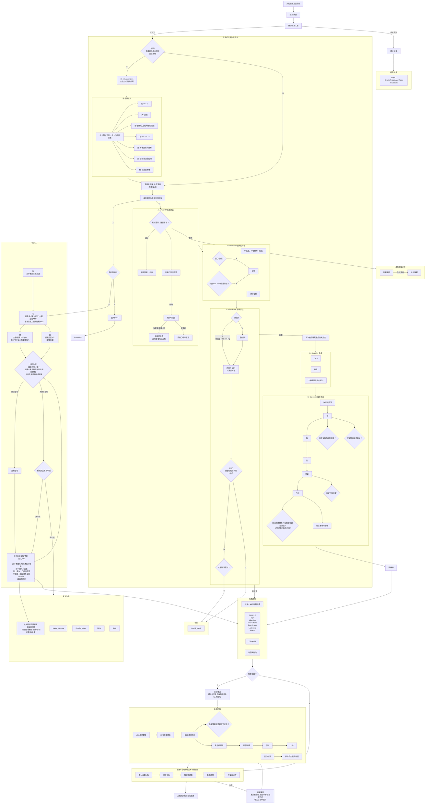

# 病患評估流程

```mermaid

flowchart TB

Eval_field[評估現場是否安全]-->Protection[自身防護]-->Patients[確認傷患人數]--"< 2 人"-->Trauma?
Patients--"多於兩人"-->請求支援-->Triage

subgraph Primary_survey[傷患初步評估與急救]
  direction TB
  Conciousness[意識與主訴: 檢查意識
    清/聲/痛/否]

  subgraph T_Neck[頸椎保護？]
    T_Neck_Main[北市頸椎守則：老大頭昏變麻機]
    T_Neck_Main --> 老[老: 65+ yr]
    T_Neck_Main --> 大[大: 大傷]
    T_Neck_Main --> 頭[頭: 鎖骨以上大外傷/穿刺傷]
    T_Neck_Main --> 昏[昏: GCS < 15]
    T_Neck_Main --> 變[變: 脊椎因外力變形]
    T_Neck_Main --> 麻[麻: 發麻或運動障礙]
    T_Neck_Main --> 機[機: 高能量機轉]
  end
  
  T_X[X: eXsanguiation
  大出血必須先處理]

  Trauma?{創傷?
          無證據為非創傷時
          認定創傷}--Y-->T_X-->T_Neck-->Conciousness
  BVM_on[使用BVM]
  Trauma?--N-->Conciousness
  Conciousness-->Agonal_breath[是否無呼吸或瀕死式呼吸]
  Agonal_breath--Y-->Cartoid_artery{頸動脈博動}
  Agonal_breath--N-->T_A

  T_A-->T_B-->T_C

  subgraph T_A[A: Airway 呼吸道評估]
    A_evaluate{異物阻塞、雜音鼾聲？}--雜音-->Liquid[液體阻塞，抽吸]
    A_evaluate-->手動打開呼吸道--鼾聲-->Aux_airway[輔助呼吸道]--有意識/意識>否-->Nasal_airway[鼻咽呼吸道
    避免觸發嘔吐反應]
    Aux_airway--無意識-->需要口咽呼吸道
  end

  subgraph T_B[B: Breath 呼吸狀態評估]
    道力氣[呼吸道，呼吸動力，氧氣]
    深淺快慢
    Open_mouth_breath{張口呼吸？}--Y-->給氧
    Gasping{每分<10, >>29或覺得喘？}--Y-->給氧
  end

  subgraph T_C[C: Circulation 循環評估]
  direction TB
    Radial_artery{橈動脈}
    Radial_artery--"Y
      收縮壓 > 60 mm-Hg"-->Count_pulses[評估7~10秒
        計算脈搏數]
    CRT{"CRT
    微血管充填時間
    > 2s?"}
    Pale_and_wet{末梢濕冷蒼白？}
    Radial_artery--"N"-->Cartoid_artery2[頸動脈]-->Count_pulses
    Count_pulses-->
    CRT--"N"-->Pale_and_wet
  end

  T_C--"創傷"-->再次檢查有無致命性大出血-->T_D
  subgraph T_D[D: Disability 失能]
    GCS
    瞳孔
    末梢感覺與動作能力
  end

  T_D-->T_E
  subgraph T_E[E: Exposure 露身檢查]
  direction TB
  快速視診頭-->頸-->胸-->腹-->骨盆-->四肢-->Fatal_wounds{瘀青腫脹變形？穿刺槍傷臟器外露?
  大而深傷口等致命傷？}
  頸-->Tracea_jugular{氣管偏移頸靜脈怒張？}
  頸-->Cervical{按壓頸椎是否異常？}
  骨盆-->Pelvis{穩定？無疼痛?}
  四肢-->視需要移除衣物
  end
end

Cartoid_artery{頸動脈博動}--N-->叫2
Cartoid_artery--Y-->BVM_on-->Trauma?2
subgraph OCHA[OCHA]
  direction TB
  叫1["叫
    主手確認病患意識"]
  叫2["叫
    副手請求旁人撥打119和取得AED
    若為急救人員則啟動AED"]
  壓[壓
    主手壓胸 110 bpm
    直到AED提示勿碰觸病人]
  電[電
    副手安裝AED
    開插貼電
    ]
  通氣壓胸[主手持續壓胸/通氣
    成人30:2

    副手準備BVM於通氣時使用
    第一優先：面罩
    第二優先：口咽呼吸道
    空檔接上儲氣袋及氧氣15L/min
    再詢問病史]
  AED_analyze{分析心律
    離開病患，換手
    副手以手勢指示離開與開始壓胸
    主手雙手懸停預備壓胸}
  Reassess_BC{重新評估脈搏呼吸}

  叫1-->叫2-->壓-->AED_analyze
  叫2-->電-->AED_analyze
  AED_analyze--建議電擊-->實施電擊-->通氣壓胸-->AED_analyze
  AED_analyze--不建議電擊-->Reassess_BC
  Reassess_BC--無心跳-->通氣壓胸
end
Reassess_BC--有心跳-->Oxygen_treatment
通氣壓胸-->Oxy_installation_proc
通氣壓胸-->Med_hist

A_evaluate--異物-->Airway_obstruction
subgraph Airway_obstruction[異物梗塞流程]
  站著腹戳--失去意識-->放倒胸戳
end

T_C--非創傷-->Med_hist
T_E-->問機轉-->Med_hist-->Em_case
Em_case{危急個案？}
適當轉送[適當轉送
  三大急重症:
  重大創傷/急性腦中風/急性冠心症
  優先往合作醫院]
就近轉送["就近轉送
  鄰近中度級急救醫院優先
  (區域醫院)"]

subgraph Mend_wounds[處置E發現的傷口骨折燒燙傷]
  傷口止血包紮-->骨折固定-->燒燙傷處置-->斷肢處理-->骨盆固定帶
end
Em_case--Y-->Mend_wounds
Em_case--N-->就近轉送-->Secondary_survey-->Mend_wounds
Mend_wounds-->上擔架床或長背板後送
Mend_wounds--危急-->適當轉送[適當轉送
重大創傷/急性腦中風/急性冠心症
優先往合作醫院]-->Secondary_survey

subgraph Secondary_survey[二度評估]
  八大生命徵象-->創傷身體檢查-->Head_2nd[觸診頭部臉部]
  Head_2nd-->Cranial{鼻漏耳漏熊貓眼耳下瘀傷？}
  Head_2nd-->胸部視觸聽-->腹部視觸-->下肢-->上肢
  懷疑中風-->排除低血糖與抽搐
end

subgraph Oxygen_treatment[氧氣治療]
  Oxy_installation_proc[給氧裝置安裝程序
  開看接開看
  開主閥-看桶壓-接導管-開流量-看流量]

Nasal_cannula
Simple_mask
NRM
BVM
end

subgraph Med_hist[病史詢問]
  主訴之前吃過藥敏感
  Sample[SAMPLE
  Sign
  Allergies
  Medications
  Past illness
  Last meal
  Event]
  OPQRST
  增質轉嚴始
end

subgraph Triage[檢傷分類]
  START["START
  Simple Triage And Rapid Treatment"]
end

CRT--"Y"-->休克
Pale_and_wet--"Y"-->休克
subgraph 休克[休克]
  Level1_shock
end
```