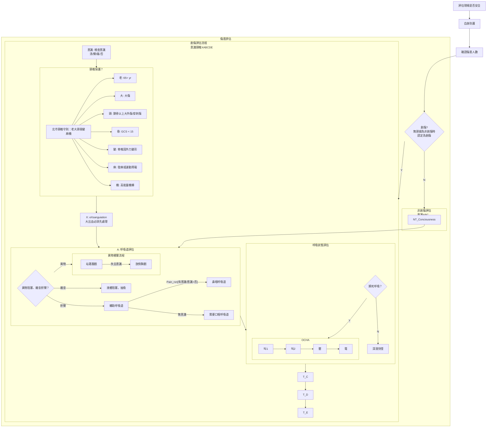

# 病患評估流程

```mermaid
flowchart TB
Eval[評估現場是否安全]-->Protection[自身防護]-->Patients[確認傷患人數]-->Trauma?;

subgraph Evaluation[傷患評估]
  direction TB
  Trauma?{創傷?
          無證據為非創傷時
          認定為創傷}--Y-->Trauma_Eval
  Trauma?--N-->Nontrauma_Eval
  class Trauma_Eval evaluation
  class NonTrauma_Eval evaluation
end
subgraph Trauma_Eval[創傷評估流程
                    意識頸椎XABCDE]
  direction TB
  T_Conciousness[意識: 檢查意識
  清/聲/痛/否]


  subgraph T_Neck[頸椎保護？]
  T_Neck_Main[北市頸椎守則：老大頭昏變麻機]
  T_Neck_Main --> 老[老: 65+ yr]
  T_Neck_Main --> 大[大: 大傷]
  T_Neck_Main --> 頭[頭: 鎖骨以上大外傷/穿刺傷]
  T_Neck_Main --> 昏[昏: GCS < 15]
  T_Neck_Main --> 變[變: 脊椎因外力變形]
  T_Neck_Main --> 麻[麻: 發麻或運動障礙]
  T_Neck_Main --> 機[機: 高能量機轉]
  end

  T_X[X: eXsanguiation
  大出血必須先處理]
  T_Conciousness-->T_Neck-->T_X-->T_A-->T_B-->T_C-->T_D-->T_E
end


subgraph T_A[A: 呼吸道評估]
  A_evaluate{異物阻塞、雜音鼾聲？}--雜音-->Liquid[液體阻塞，抽吸]
  A_evaluate--異物-->Away_obstruction
  A_evaluate--鼾聲-->Aux_airway[輔助呼吸道]--Pain_rxn[有意識/意識>否]-->鼻咽呼吸道
  Aux_airway--無意識-->需要口咽呼吸道
end

subgraph T_B[呼吸狀態評估]
Agonal_breath{瀕死呼吸？}--Y-->OCHA
Agonal_breath--N-->深淺快慢
end

subgraph Nontrauma_Eval[非創傷評估
                        意識ABC]
  direction TB
  NT_Conciousness-->T_A
end

subgraph OCHA[OCHA]
  叫1-->叫2-->壓-->電
end

subgraph Away_obstruction[異物梗塞流程]
  站著腹戳--失去意識-->放倒胸戳
end
```