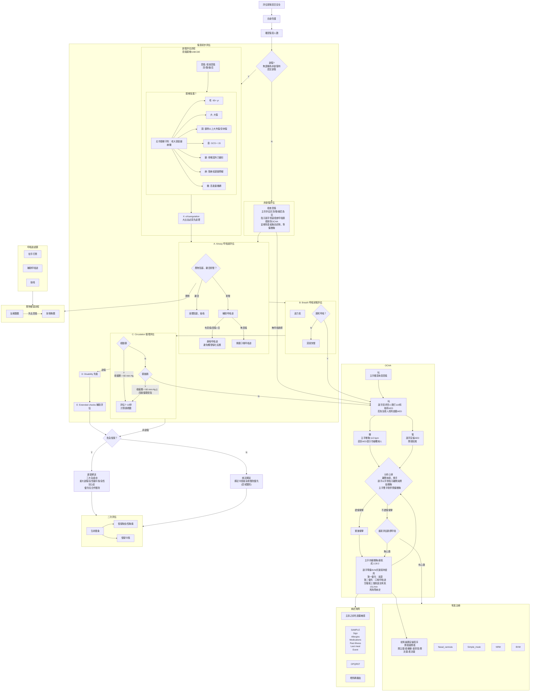

# 病患評估流程

```mermaid

flowchart TB

Eval_field[評估現場是否安全]-->Protection[自身防護]-->Patients[確認傷患人數]-->Trauma?

subgraph Primary_survey[傷患初步評估]
  direction TB
  Trauma?{創傷?
          無證據為非創傷時
          認定創傷}--Y-->Trauma_Eval

  Trauma?--N-->Nontrauma_Eval

  subgraph Trauma_Eval[創傷評估流程
                      意識頸椎XABCDE]
    direction TB
    T_Conciousness[意識: 檢查意識
    清/聲/痛/否
    ]
    subgraph T_Neck[頸椎保護？]
    T_Neck_Main[北市頸椎守則：老大頭昏變麻機]
    T_Neck_Main --> 老[老: 65+ yr]
    T_Neck_Main --> 大[大: 大傷]
    T_Neck_Main --> 頭[頭: 鎖骨以上大外傷/穿刺傷]
    T_Neck_Main --> 昏[昏: GCS < 15]
    T_Neck_Main --> 變[變: 脊椎因外力變形]
    T_Neck_Main --> 麻[麻: 發麻或運動障礙]
    T_Neck_Main --> 機[機: 高能量機轉]
    end

    T_X[X: eXsanguiation
    大出血必須先處理]
    T_Conciousness-->T_Neck-->T_X
  end

  T_X-->T_A-->T_B-->T_C

  subgraph T_A[A: Airway 呼吸道評估]
    A_evaluate{異物阻塞、雜音鼾聲？}--雜音-->Liquid[液體阻塞，抽吸]
    A_evaluate--鼾聲-->Aux_airway[輔助呼吸道]--有意識/意識>否-->Nasal_airway[鼻咽呼吸道
    避免觸發嘔吐反應]
    Aux_airway--無意識-->需要口咽呼吸道
  end

  subgraph T_B[B: Breath 呼吸狀態評估]
    道力氣
    Agonal_breath{瀕死呼吸？}
    Agonal_breath--N-->深淺快慢
  end


  subgraph T_C[C: Circulation 循環評估]
    Radial_artery{橈動脈}--N-->Cartoid_artery{頸動脈}
    Radial_artery--"Y
      收縮壓 > 60 mm-Hg"-->Count_pulses[評估7~10秒
        計算脈搏數]
    Cartoid_artery--"Y
      收縮壓 < 60 mm-Hg || 四肢循環受阻"-->Count_pulses
  end
  T_C--"創傷"-->T_D-->T_E
  subgraph T_D[D: Disability 失能]
  end

  subgraph T_E[E: Extended checks 輔助評估]
  end

  subgraph Nontrauma_Eval[非創傷評估
                          意識ABC]
    direction TB
    NT_Conciousness[檢查意識
    主手評估完清/聲/痛若為否
    指示副手快速檢查呼吸脈搏排除OCHA
    並移除患者胸前衣物，準備壓胸]
  end
  NT_Conciousness-->T_A
end

Cartoid_artery--N-->叫2
NT_Conciousness--無呼吸脈搏-->叫2
Agonal_breath--Y-->叫2
subgraph OCHA[OCHA]
  direction TB
  叫1["叫
    主手確認病患意識"]
  叫2["叫
    副手請求旁人撥打119和取得AED
    若為急救人員則啟動AED"]
  壓[壓
    主手壓胸 110 bpm
    直到AED提示勿碰觸病人]
  電[電
    副手安裝AED
    開插貼電
    ]
  通氣壓胸[主手持續壓胸/通氣
    成人30:2

    副手準備BVM於通氣時使用
    第一優先：面罩
    第二優先：口咽呼吸道
    空檔接上儲氣袋及氧氣15L/min
    再詢問病史]
  AED_analyze{分析心律
    離開病患，換手
    副手以手勢指示離開與開始壓胸
    主手雙手懸停預備壓胸}
  Reassess_BC{重新評估脈搏呼吸}

  叫1-->叫2-->壓-->AED_analyze
  叫2-->電-->AED_analyze
  AED_analyze--建議電擊-->實施電擊-->通氣壓胸-->AED_analyze
  AED_analyze--不建議電擊-->Reassess_BC
  Reassess_BC--無心跳-->通氣壓胸
end
Reassess_BC--有心跳-->Oxygen_treatment
通氣壓胸-->Oxy_installation_proc
通氣壓胸-->Med_hist

A_evaluate--異物-->Airway_obstruction
subgraph Airway_obstruction[異物梗塞流程]
  站著腹戳--失去意識-->放倒胸戳
end

T_C--非創傷-->Em_case
T_E-->Em_case
Em_case{危急個案？}
適當轉送[適當轉送
  三大急重症:
  重大創傷/急性腦中風/急性冠心症
  優先往合作醫院]
就近轉送["就近轉送
  鄰近中度級急救醫院優先
  (區域醫院)"]
Em_case--Y-->適當轉送-->Secondary_survey
Em_case--N-->就近轉送-->Secondary_survey


subgraph Secondary_survey[二次評估]
  生命徵象-->懷疑缺血性胸痛
  生命徵象-->懷疑中風
end

subgraph Oxygen_treatment[氧氣治療]
  Oxy_installation_proc[給氧裝置安裝程序
  開看接開看
  開主閥-看桶壓-接導管-開流量-看流量]

Nasal_cannula
Simple_mask
NRM
BVM
end

subgraph Airway_treatment[呼吸道處置]
  徒手打開
  輔助呼吸道
  抽吸
end
Airway_treatment-->Airway_obstruction

subgraph Med_hist[病史詢問]
  主訴之前吃過藥敏感
  Sample[SAMPLE
  Sign
  Allergies
  Medications
  Past illness
  Last meal
  Event]
  OPQRST
  增質轉嚴始
end
```