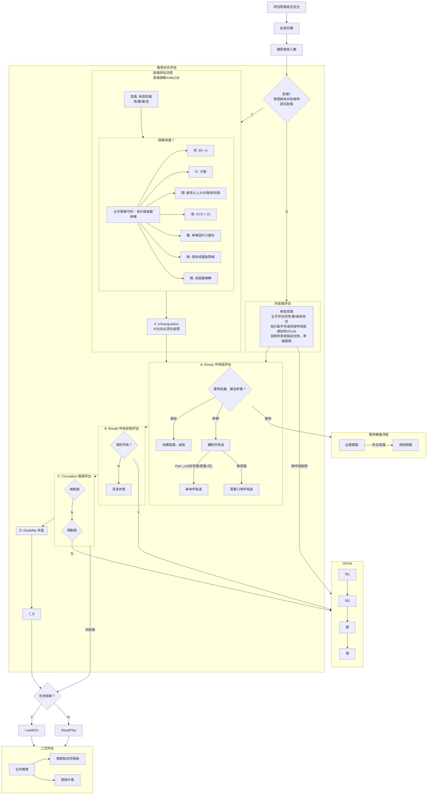

# 病患評估流程

```mermaid
flowchart TB

Eval_field[評估現場是否安全]-->Protection[自身防護]-->Patients[確認傷患人數]-->Trauma?

subgraph 1stEvaluation[傷患初步評估]
  direction TB
  Trauma?{創傷?
          無證據為非創傷時
          認定創傷}--Y-->Trauma_Eval

  Trauma?--N-->Nontrauma_Eval

  subgraph Trauma_Eval[創傷評估流程
                      意識頸椎XABCDE]
    direction TB
    T_Conciousness[意識: 檢查意識
    清/聲/痛/否
    ]
    subgraph T_Neck[頸椎保護？]
    T_Neck_Main[北市頸椎守則：老大頭昏變麻機]
    T_Neck_Main --> 老[老: 65+ yr]
    T_Neck_Main --> 大[大: 大傷]
    T_Neck_Main --> 頭[頭: 鎖骨以上大外傷/穿刺傷]
    T_Neck_Main --> 昏[昏: GCS < 15]
    T_Neck_Main --> 變[變: 脊椎因外力變形]
    T_Neck_Main --> 麻[麻: 發麻或運動障礙]
    T_Neck_Main --> 機[機: 高能量機轉]
    end

    T_X[X: eXsanguiation
    大出血必須先處理]
    T_Conciousness-->T_Neck-->T_X
  end

  T_X-->T_A-->T_B-->T_C-->T_D-->T_E

  subgraph T_A[A: Airway 呼吸道評估]
    A_evaluate{異物阻塞、雜音鼾聲？}--雜音-->Liquid[液體阻塞，抽吸]
    A_evaluate--鼾聲-->Aux_airway[輔助呼吸道]--Pain_rxn[有意識/意識>否]-->鼻咽呼吸道
    Aux_airway--無意識-->需要口咽呼吸道
  end

  subgraph T_B[B: Breath 呼吸狀態評估]
    Agonal_breath{瀕死呼吸？}
    Agonal_breath--N-->深淺快慢
  end


  subgraph T_C[C: Circulation 循環評估]
    Radial_artery{橈動脈}--N-->Cartoid_artery{頸動脈}
  end

  subgraph T_D[D: Disability 失能]
  end

  subgraph T_D[E: Extended checks 輔助評估]
  end

  subgraph Nontrauma_Eval[非創傷評估
                          意識ABC]
    direction TB
    NT_Conciousness[檢查意識
    主手評估完清/聲/痛若為否
    指示副手快速檢查呼吸脈搏排除OCHA
    並移除患者胸前衣物，準備壓胸]
  end
  NT_Conciousness-->T_A
end

Cartoid_artery--N-->OCHA
NT_Conciousness--無呼吸脈搏-->OCHA
Agonal_breath--Y-->OCHA
subgraph OCHA[OCHA]
  direction TB
  叫1-->叫2-->壓-->電
end

A_evaluate--異物-->Away_obstruction
subgraph Away_obstruction[異物梗塞流程]
  站著腹戳--失去意識-->放倒胸戳
end

T_C--非創傷-->Em_case
T_E-->Em_case
Em_case{危急個案？}
Em_case--Y-->Load&Go-->2ndEvaluation
Em_case--N-->Stay&Play-->2ndEvaluation

subgraph 2ndEvaluation[二次評估]
  生命徵象-->懷疑缺血性胸痛
  生命徵象-->懷疑中風
end

```